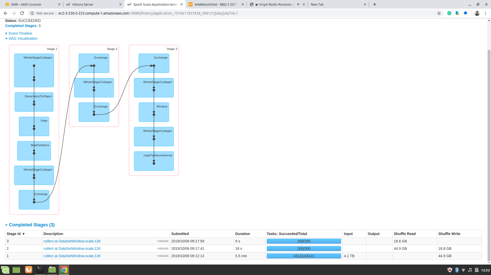

# Group 44

by [Andrei Simion-Constantinescu](https://github.com/simionAndrei),
[Mihai Voicescu](https://github.com/mihai1voicescu)

# Table of Contents

1.  [Introduction](#introduction)
2.  [Solution details](#solution-details)
3.  [Running parameters configuration](#running-parameters-configuration)
4.  [Initial tests](#initial-tests)
5.  [Final tests](#final-tests)

# Introduction

***Figure 1*** - Test image

# Solution details

## DataSetWindow

## RDD

## RDDFast

## DataSetWindow2

# Running parameters configuration

## Number of executors and memory

## KryoSerializer

## offHeap enabled

# Initial tests

# Final tests

| Running ID | Description                                                                                                        | Time    |
|------------|--------------------------------------------------------------------------------------------------------------------|---------|
| 1          | **DataSetWindow** with 1 executor per node, 34 cores and 16GB memory per executor                                      | 403.11s |
| 2          | **RDD** with 1 executor per node, 34 cores and 16GB memory per executor                                                | 653.15s |
| 3          | **RDDFast** with 1 executor per node, 34 cores and 16GB memory per executor                                            | 472.95s |
| 4          | **DataSetWindow** 1 executor per node, 34 cores and 42GB memory per executor                                           | 455.26s |
| 5          | **RDDFast** with 5 executors per node, 7 cores and 5GB memory per executor                                             | 425.19s |
| 6          | **DataSetWindow2** with 1 executor per node, 34 cores and 16GB memory per executor                                     | 400.41s |
| 7          | **DatasetWindow2** with 1 executor per node, 34 cores and 8GB memory per executor, KryoSerializer and offHeap of 16GB  | 432.52s |
| 8          | **DatasetWindow2** with 1 executor per node, 34 cores and 16GB memory per executor, KryoSerializer and offHeap of 16GB | 385.09s |
