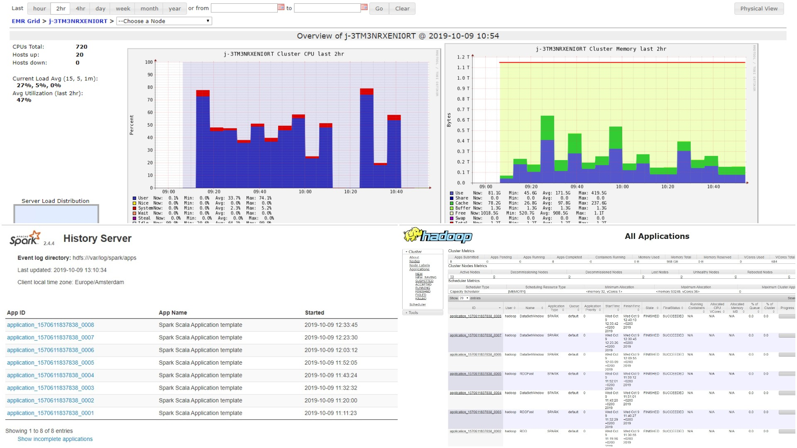
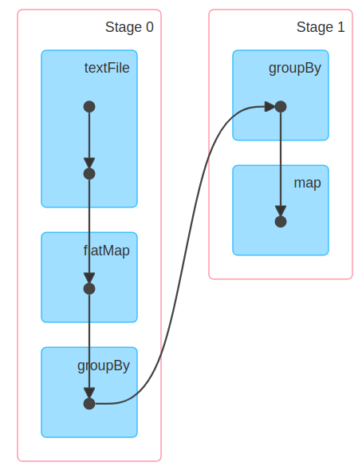
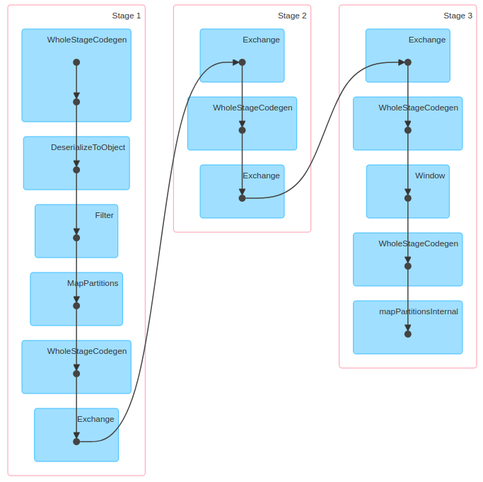
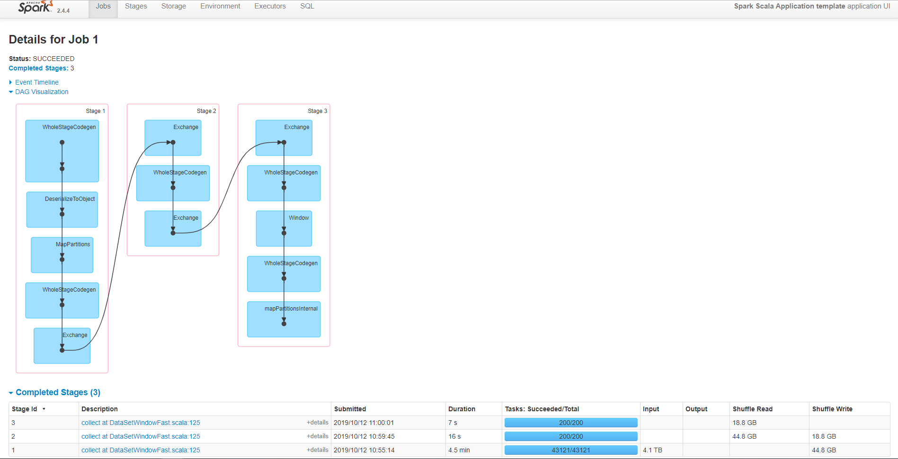
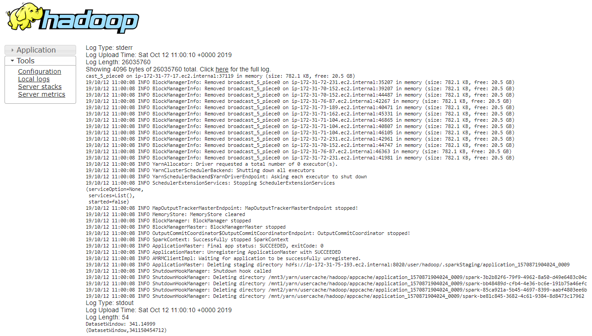
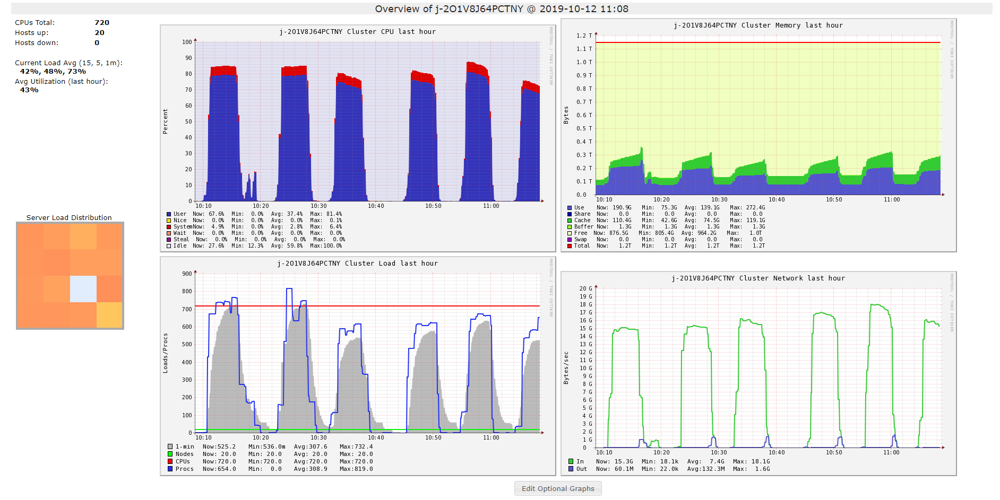

# Group 44

by [Andrei Simion-Constantinescu](https://github.com/simionAndrei),
[Mihai Voicescu](https://github.com/mihai1voicescu)

# Table of Contents

1.  [Introduction](#introduction)
2.  [Solution details](#solution-details)
  * [RDD](#rdd)
  * [RDDFast](#rddfast)
  * [DataSetWindow](#datasetwindow)
  * [DataSetWindow2](#datasetwindow2)
  * [DataSetWindowFast](#datasetwindowfast)
3.  [Initial tests](#initial-tests)
  * [Small 10 machines cluster](#small-10-machines-cluster)
  * [Medium 10 machines cluster](#medium-10-machines-cluster)
4.  [Running parameters configuration](#running-parameters-configuration)
  * [Number of executors and memory](#number-of-executors-and-memory)
  * [Kryo Serializer](#kyro-serializer)
  * [offHeap enabled](#offHeap-enabled)
5.  [Final tests](#final-tests)
  * [Running with default configurations](#running-with-default-configurations)
  * [Running with custom configurations](#running-with-custom-configurations)

# Introduction

***Figure 1*** - Web Interfaces used to monitor our application from AWS cluster: Ganglia (up), Spark History Server (left), Resource Manager (right)

# Solution details
All our solutions use a `flatMap` to get the required format from the input. Each subsection describes what happens
after the `flatMap` operation.

## RDD Implementation
Group by the day, this will bring all the data locally to an executor, making it possible to process afterwards.

***Figure 2*** - RDD DAG Visualization

### RDD class
Use scala lambdas afterwards to get the required results. 

### RDDFast class
Use a `mutable.HashMap` to calculate the counts and a `mutable.PriorityQueue` while storing the minimum value (in order to avoid push-pop operations) to get the top 10 results.

## Dataset Implementation
We perform filtering, grouping and counting. Afterwards we use the `Window` class to partition the results and count the top 10.

***Figure 3*** - Dataset DAG Visualization

### DataSetWindow class
Filter out the empty `allNames` using the `filter` spark feature before doing the `flatMap`.
Use a `Timestamp` to store the date.
`groupBy` the `date` and `topicName` and `count`.

### DataSetWindow2 class
Filter out the empty `allNames` using the `filter` spark feature before doing the `flatMap`.
Use an `Int` to store the date.
`groupBy` the `date` and `topicName` and `count`.

### DataSetWindowFast class
Filter out the empty `allNames` using an `if` in the `flatMap` previously mentioned.
Use an `Int` to store the date.
`groupBy` the `date` and `topicName` and `count`.

# Initial tests
Initially we wanted to see if our application scale with the number of available cores. We have determined that as long as the servers do not
run into memory problems, our application scale linearly with the resources. One thing to note is that on each core, a fixed
number of resources(core and memory) has to be allocated in order for the cluster to run (eg YARN). This makes powerful
machines more efficient, then the equivalent of more but smaller ones.

We have also determined, by looking at the shuffle size, that the Kyro serialization decreases the overhead (smaller shuffle size when Kiro Serializer is enabled). Moreover, on the small tests the offHeap and Kyro serialization settings seem to have negligible impact on speed.

All tests performed on the small and medium clusters were conducted using the `RDD` class implementation.

## Small 10 machines cluster

| Running ID | Data interval | Input size | Shuffle size | Time     |
|------------|---------------|------------|--------------|----------|
| 1          | 10 days       | ~25GB      | ~340MB       | 119.72s  |
| 2          | 1 month       | ~74GB      | ~999MB       | 264.13s  |
| 3          | 1 year        | ~1.2TB     | ~16GB        | 3680.12s |

***Table 1*** - Running results on 10m4.large (4vCore, 8GB) AWS instances

## Medium 10 machines cluster

| Running ID | Data interval | Input size | Shuffle size | Time     |
|------------|---------------|------------|--------------|----------|
| 1          | 1 month       | ~74GB      | ~999MB1      | 156.78s  |
| 2          | 3 months      | ~214GB     | ~2.8GB2     | 417.66s  |
| 3          | 1 year        | ~1.2TB     | ~16GB        | 1815.83s |

***Table 2*** - Running results on 10m4.xlarge (8vCore, 16GB) AWS instances  
1 822.5MB when KryoSerializer enabled  
2 2.3GB when KryoSerializer enabled    

# Running with default configurations
Unfortunately with defaults we were running out of memory and the cluster was crashing.
As far as we can tell we were not even using the YARN. In the interface it was registering that we were
only using 1 vCPU per slave.

# Running parameters configuration

## Number of executors
Tuning the right number of executors is tricky. According to [this blog post](https://spoddutur.github.io/spark-notes/distribution_of_executors_cores_and_memory_for_spark_application.html),
the HDFS has problems handling more then 5 tasks per executor. This mean that a Fat executor(1 executor with all the
cores per node) setup will hurt the HDFS throughput. The Slim executor setup(1 core per executor and nodes have
num_cores executors) is not much better, as we can not take advantage of running multiple tasks on the same JVM.
This will also result in memory overhead as the potentially shared variables need to be replicated on each JVM.
We have also experimentally proven these claims, therefore a balanced approach is required.

Also it is very important to leave 1-2 free cores for the rest of the running processes(YARN etc.).

## Memory
You can increase/decrease the memory executors have using `driver-memory` and `executor-memory`.
According to an [Amazon blog post](https://aws.amazon.com/blogs/big-data/best-practices-for-successfully-managing-memory-for-apache-spark-applications-on-amazon-emr/)
it is recommended to set them both to the same value, but they must all fit inside a nodes memory so
`num_executor * executor_memory < node_memory`. We should also consider that there are more processes running on the
nodes, so leave some out for them.  

## Kryo Serializer
[Spark uses by default the standard Java serializer](#https://spark.apache.org/docs/latest/tuning.html#data-serialization).
This has a big overhead, so we used the Kyro Serializer which allows better throughput.

## offHeap enabled
Because the offHeap memory does not follow the standard Java representation it consumes less memory and is not
under the GC it provides lower overhead.

# Final tests

## Running with custom configurations

| Running ID | Description                                                                                                                  | Time    |
|------------|------------------------------------------------------------------------------------------------------------------------------|---------|
| 1          | **DataSetWindow** with 1 executor per node, 34 cores and 16GB memory per executor                                            | 403.11s |
| 2          | **RDD** with 1 executor per node, 34 cores and 16GB memory per executor                                                      | 653.15s |
| 3          | **RDDFast** with 1 executor per node, 34 cores and 16GB memory per executor                                                  | 472.95s |
| 4          | **DataSetWindow** 1 executor per node, 34 cores and 42GB memory per executor                                                 | 455.26s |
| 5          | **RDDFast** with 5 executors per node, 7 cores and 5GB memory per executor                                                   | 425.19s |
| 6          | **DataSetWindow2** with 1 executor per node, 34 cores and 16GB memory per executor                                           | 400.41s |
| 7          | **DatasetWindow2** with 1 executor per node, 34 cores and 8GB memory per executor, KryoSerializer and offHeap of 16GB        | 432.52s |
| 8          | **DatasetWindow2** with 1 executor per node, 34 cores and 16GB memory per executor, KryoSerializer and offHeap of 16GB       | 385.09s |
| 9          | **DatasetWindowFast** with 1 executor per node, 34 cores and 16GB memory per executor, KryoSerializer and offHeap of 16GB    | 381.16s |
| 10         | **DatasetWindowFast** with 2 executors per node, 17 cores and 16GB memory per executor, KryoSerializer and offHeap of 16GB   | 372.11s |
| 11         | **DatasetWindowFast** with 3 executors per node, 11 cores and 12GB memory per executor, KryoSerializer and offHeap of 16GB   | 355.56s |
| 12         | **DatasetWindowFast** with 5 executors per node, 7 cores and 8GB memory per executor, KryoSerializer and offHeap of 16GB     | 341.14s |

***Table 3*** - Running results on 20c4.8xlarge (36vCore, 60GB) AWS instances

***Figure 4*** - Spark History Server for running ID 12 from _Table 2_

***Figure 5*** -Application output for running ID 12 from _Table 2_

***Figure 6*** - Ganglia for the final running tests

# Conclusion
In conclusion the fastest way to solve this problem is by using a DataSet implementation, taking advantage of the features
that solve the problem of the JVM usage, selecting the right amount of cores per executor as to not hard the HDFS(7 cores)
and maxing out on the cores(5 executors) and memory(8GB with 16 offHeap) while leaving some out for the rest of the processes.
